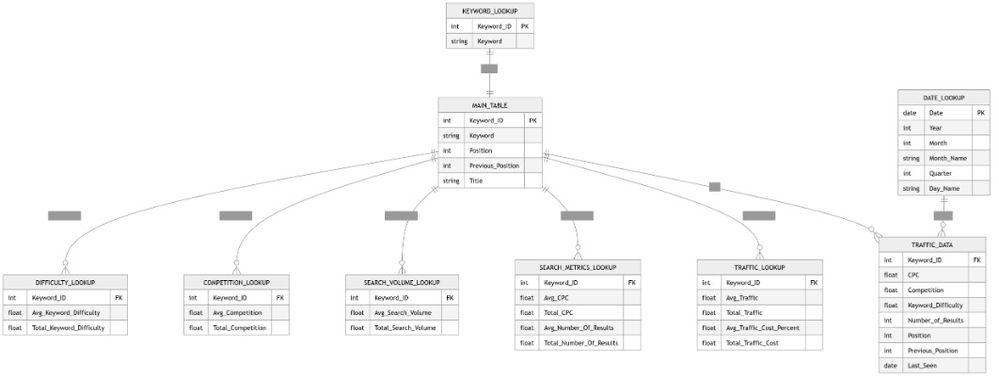
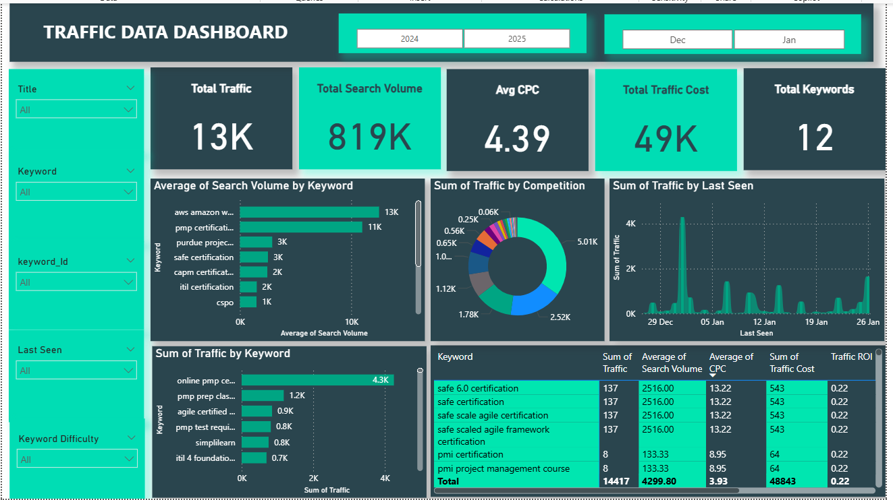

# 📊 Traffic Data Adwords Analysis Dashboard (MySQL + Power BI)

## 📌 Project Overview

This project demonstrates an end-to-end data analytics workflow using **MySQL** and **Power BI** to analyze SEO traffic data.
The objective is to transform raw keyword-level data into meaningful insights through data cleaning, modeling, and interactive dashboard creation.

---

## 🛠️ Tech Stack

* **Database:** MySQL
* **Visualization Tool:** Power BI
* **Data Format:** CSV
* **Data Modeling:** Star Schema

---

## 📂 Dataset Description

The project uses multiple datasets:
* **Source** :  traffic_data-adwords.Positions-us.xlsx
* **File Used** :
- main_table.csv
- keyword_lookup.csv
- search_volume_lookup.csv
- traffic_lookup.csv
- search_metrics_lookup.csv
- competition_lookup.csv
- difficulty_lookup.csv
- date_lookup.csv
- traffic_data.csv

🔗 **[View traffic_data Dataset](https://github.com/dimple-shah-au13/Traffic-Data-Adwords-Analysis/blob/main/csv/traffic_data.csv )**

🔗 **[View main_table Dataset](https://github.com/dimple-shah-au13/Traffic-Data-Adwords-Analysis/blob/main/csv/main_table.csv )**

🔗 **[View keyword_lookup Dataset](https://github.com/dimple-shah-au13/Traffic-Data-Adwords-Analysis/blob/main/csv/keyword_lookup.csv )**

🔗 **[View search_volume_lookup Dataset](https://github.com/dimple-shah-au13/Traffic-Data-Adwords-Analysis/blob/main/csv/search_volume_lookup.csv )**

🔗 **[View traffic_lookup Dataset](https://github.com/dimple-shah-au13/Traffic-Data-Adwords-Analysis/blob/main/csv/traffic_lookup.csv )**

🔗 **[View search_metrics_lookup Dataset](https://github.com/dimple-shah-au13/Traffic-Data-Adwords-Analysis/blob/main/csv/search_metrics_lookup.csv )**

🔗 **[View competition_lookup Dataset](https://github.com/dimple-shah-au13/Traffic-Data-Adwords-Analysis/blob/main/csv/competition_lookup.csv )**

🔗 **[View difficulty_lookup Dataset](https://github.com/dimple-shah-au13/Traffic-Data-Adwords-Analysis/blob/main/csv/difficulty_lookup.csv )**

🔗 **[View date_lookup Dataset](https://github.com/dimple-shah-au13/Traffic-Data-Adwords-Analysis/blob/main/csv/date_lookup.csv )**

---

## 🧱 Database Design

📊 Data Model Type:
- Star Schema (Fact + Dimension Model)

📁 Tables Used:
🔹 1. Main Table (traffic_data_adwords_main_table)
Contains keyword-level master data
Acts as a central reference table
Columns:
- Keyword_ID (Primary Key)
- Keyword
- Position
- Previous_Position
- Title

👉 Purpose:
Serves as the base entity for all relationships

🔹 2. Traffic Data (Fact Table) (traffic_data_adwords_traffic_data)
Core transactional dataset
Stores detailed keyword performance metrics

Columns include:
- Keyword_ID (Foreign Key)
- CPC
- Competition
- Keyword_Difficulty
- Number_of_Results
- Position
- Previous_Position
- Last_Seen

👉 Purpose:
Main fact table used for analysis and reporting

🔹 3. Lookup Tables (Dimension Tables)
These tables store aggregated and derived metrics for analysis.

📌 keyword_lookup
Maps keywords to Keyword_ID
Helps maintain data consistency

📌 traffic_lookup
Stores traffic-related metrics:
- Avg_Traffic
- Total_Traffic
- Traffic_Cost
- Traffic_Percentage

📌 search_metrics_lookup
Stores SEO-related metrics:
- Avg_CPC
- Total_CPC
- Avg_Number_Of_Results
- Total_Number_Of_Results

📌 search_volume_lookup
Stores search demand metrics:
- Avg_Search_Volume
- Total_Search_Volume

📌 competition_lookup
Stores competition metrics:
- Avg_Competition
- Total_Competition

📌 difficulty_lookup
Stores keyword difficulty metrics:
- Avg_Keyword_Difficulty
- Total_Keyword_Difficulty

🔹 4. Date Lookup Table (traffic_data_adwords_date_lookup)
Time dimension table for temporal analysis
Columns:
- Date
- Year
- Month
- Month_Name
- Quarter
- Day_Name

👉 Purpose:
Enables time-based analysis (trend, seasonality)

---

## 🔗 ERD Diagram

---

## 🛢️ SQL Queries Used

🔗 **[View All Queries](https://github.com/dimple-shah-au13/Traffic-Data-Adwords-Analysis/blob/main/sql/traffic.sql)**

🔗 **[View Task-1](https://github.com/dimple-shah-au13/Traffic-Data-Adwords-Analysis/blob/main/sql/Task-1.sql)**
🔗 **[View Task-2](https://github.com/dimple-shah-au13/Traffic-Data-Adwords-Analysis/blob/main/sql/Task-2.sql)**
🔗 **[View Task-3](https://github.com/dimple-shah-au13/Traffic-Data-Adwords-Analysis/blob/main/sql/Task-3.sql)**
🔗 **[View Task-4](https://github.com/dimple-shah-au13/Traffic-Data-Adwords-Analysis/blob/main/sql/Task-4.sql)**

---

## 🧹 Data Cleaning (MySQL)

Data cleaning was performed using SQL queries:

- Removed duplicates using DISTINCT
- Handled NULL values using IFNULL / UPDATE
- Trimmed extra spaces using TRIM()
- Check if any bad text values exist
- Standardized data types (INT, DECIMAL, DATE)
- Validated referential integrity between tables

---

## 🏗️ Data Modeling

A **Star Schema** was implemented:
✔ Cardinality: Many-to-One

---

## 🔗 Power BI Integration

Data was imported from MySQL into Power BI using:
> Get Data → MySQL Database → Load Tables
Relationships were configured in Model View.

---

## 🧮 DAX Measures Used

### 🔹 Basic Measures

**Total Traffic** = SUM('traffic_data_adwords traffic_lookup'[Total_Traffic])

**Total Search Volume** = SUM('traffic_data_adwords search_volume_lookup'[Total_Search_Volume])

**Avg CPC** = AVERAGE('traffic_data_adwords search_metrics_lookup'[Avg_CPC])
 
**Total Traffic Cost** = SUM('traffic_data_adwords traffic_lookup'[Total_Traffic_Cost]) 

**Total Keywords** = DISTINCTCOUNT('traffic_data_adwords keyword_lookup'[Keyword_Id])

---

### 🔹 Advanced Measures

**Traffic ROI** = 
DIVIDE([Total Traffic], [Total Traffic Cost])

**Traffic LastYear** = 
CALCULATE(
    [Total Traffic],
    SAMEPERIODLASTYEAR('Date Table'[Date])
) 

**Traffic LY Manual** = 
VAR CurrentMin = MIN('Date Table'[Date])
VAR CurrentMax = MAX('Date Table'[Date])
RETURN
CALCULATE(
    [Total Traffic],
    FILTER(
        ALL('Date Table'),
        'Date Table'[Date] >= EDATE(CurrentMin, -12) &&
        'Date Table'[Date] <= EDATE(CurrentMax, -12)
    )
)

**YoY Growth %** = 
DIVIDE(
    [Total Traffic] - [Traffic LastYear],
    [Traffic LastYear]
)

**Date Table** = 
ADDCOLUMNS(
    CALENDAR(MIN('traffic_data_adwords date_lookup'[Last Seen]), MAX('traffic_data_adwords date_lookup'[Last Seen])),
    "Year", YEAR([Date]),
    "Month", FORMAT([Date], "MMM"),
    "Month Number", MONTH([Date])
)

---

## 🔑 Key Performance Indicators (KPIs)

The dashboard highlights major business KPIs:
* Total Traffic
* Total Search Volume
* Avg CPC
* Total Traffic Cost
* Total Keywords

---

### 📊 Dashboard Visuals & Insights

### 📍 1. Keyword Traffic Overview

## 📊 Top Keywords by Traffic (Bar Chart)
Shows keywords driving maximum traffic
Helps identify top-performing keywords

## 📈 Traffic Trend Over Time (Line Chart)
Based on Last Seen / Date table
Shows traffic fluctuations over time

## 🥧 Traffic Share by Keyword (Pie Chart)
Distribution of traffic across keywords
Highlights dominant vs low-impact keywords

### 📍 2. Keyword Performance Analysis
**Visual**: Matrix Table
**Metrics**:
- Keyword
- Total Traffic
- Total Traffic Cost
- Avg CPC
- AVG Search Volume
- Traffic ROI

---

## 🎛️ Filters & Interactivity

* 🔍 Keyword slicer
* 📅 Date slicer (Year / Month)
* 📊 Last Seen filter
* 🎯 Keyword Difficulty filter
* 🔝 Top N keyword selection
* 🔎 Drill-down (Year → Month → Day)
* 🔥 Cross-filtering across all visuals
* 🔥 Drill-down capabilities

---

## 🚀 Key Insights

## 🔥 1. High Traffic Keywords
Few keywords contribute majority of traffic
👉 Pareto effect (80/20 rule) observed

## 💰 2. Cost vs Traffic Efficiency
Some keywords have:
High CPC but low traffic → inefficient
👉 Budget optimization opportunity

## 📈 3. Search Demand vs Traffic Gap
High search volume but low traffic keywords
👉 Indicates:
Poor ranking OR high competition

## ⚔️ 4. Competition Impact
High competition keywords:
Higher CPC
Lower ROI
👉 Focus on medium competition keywords

## 🧠 5. Keyword Difficulty Insight
High difficulty keywords:
Require more effort to rank
👉 Not ideal for short-term gains

## 🎯 6. Opportunity Keywords (MOST IMPORTANT)
Keywords with:
High Search Volume
Low CPC
Medium Competition
👉 Best ROI targets

## 📊 7. Traffic Concentration
Traffic is concentrated in limited keywords
👉 Risk: over-dependence

---

## 📷 Dashboard Interaction -->>>>

🔗 **[View Raw Traffic Data Adwords Analysis Dashboard](https://github.com/dimple-shah-au13/Traffic-Data-Adwords-Analysis/blob/main/Traffic-Data.pbix)**

⚠️ Note: This dashboard file must be opened using **Microsoft Power BI Desktop** by clicking on View raw.

## 📎 How to Use

1. Import CSV data into MySQL
2. Perform data cleaning using SQL queries
3. Connect Power BI to MySQL database
4. Load tables and create relationships
5. Build measures and visuals

---

## 📷 Dashboard Preview  

Here’s a preview of the interactive dashboard:

## 👩‍💻 Author

**Dimple Shah**
- Data Analyst | Excel | Power BI | Tableau | SQL | Python | Business Intelligence Enthusiast
---

## GITHUB -->>>>

🔗 <a href ="https://github.com/dimple-shah-au13/Traffic-Data-Adwords-Analysis/tree/main">GITHUB</a>

---

## ⭐ Support

If you like this project, don’t forget to ⭐ star the repository on GitHub!